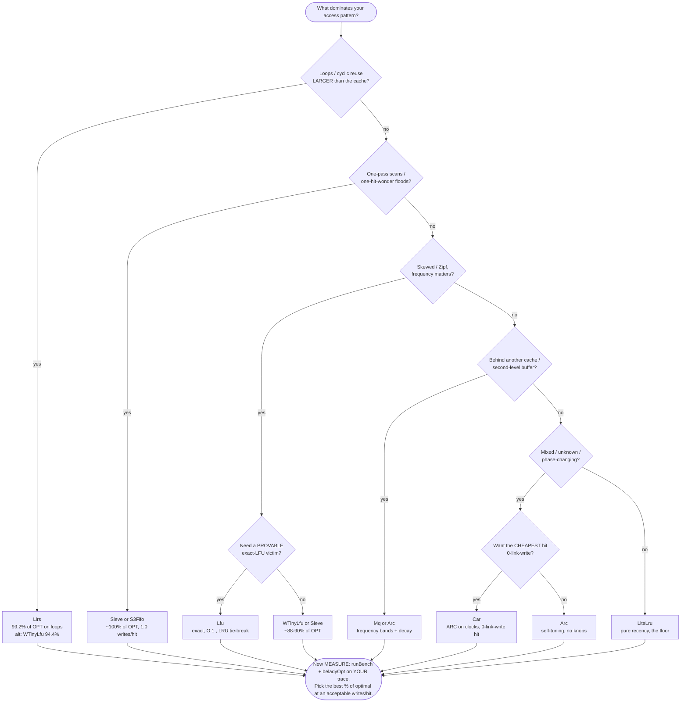

# Choosing a cache member -- a field guide

`@zakkster/lite-lru` ships **thirteen** eviction policies behind one identical
`LiteCache<K,V>` surface. This guide is the opinionated, measurement-driven
companion to the API docs: it tells you where to *start*, why the classic
choices lose, and -- the part that actually matters -- how to stop guessing and
**measure** which member fits your real trace.

> **The one rule that overrides everything below.** Do not choose by theory.
> The best policy is a property of *your* access pattern, not of any paper.
> Capture a short trace of your real keys, run `runBench` + `beladyOpt`, and
> pick the member with the best **% of Belady optimal** at an acceptable
> **writes/hit**. Every table in this guide is a *starting hypothesis to test*,
> not a verdict -- and the numbers below will show you a case where the theory
> is flatly wrong on a real workload.

This file lives in the repo only (it is not in the npm tarball). The shipped
`README.md` carries a concise version of the table; `llms.txt` carries the
per-member "good for / not for". This guide is the long form.

---

## 1. TL;DR decision table

Thirteen members, one constructor swap. Start here, then measure (section 4).

| Your workload / need | Start with | Strong alternative | Avoid | Measured signal (see section 4) |
| --- | --- | --- | --- | --- |
| General web / CDN, many one-hit-wonders | `Sieve` | `S3Fifo` | `LiteLru` | zipf 89.8% OPT at **1.0 writes/hit**; LiteLru 77% |
| Strongly skewed / Zipf popularity | `WTinyLfu` or `Sieve` | `Lfu`, `Arc` | `LiteLru` | zipf %OPT: Sieve 89.8, Lfu 88.4, WTinyLfu 88.3, Arc 88.1; LiteLru 77.2 |
| Repeated one-pass **scans** (working set > cache) | `Sieve` or `S3Fifo` | `Slru`, `TwoQ`, `LruK`, `Arc` | `LiteLru`, `ClockPro` | scan ~100% OPT for most; LiteLru 72%, ClockPro 84.5% |
| **Loops** / cyclic reuse LARGER than capacity | `Lirs` | `WTinyLfu` | everything else | loop %OPT: **Lirs 99.2, WTinyLfu 94.4, all others 0.0** |
| Second-level / behind-another-cache buffer | `Mq` | `Arc`, `Lirs` | `LiteLru` | MQ is built for this (frequency bands + decay) |
| Phase-changing traffic, no time to tune | `Arc` | `WTinyLfu`, `Car` | -- | self-tuning, no knobs; 88.1% zipf |
| Self-tuning like ARC but with the CHEAPEST hit (0-link-write) | `Car` | `Arc`, `ClockPro` | -- | ARC's adaptation on clocks; hit sets 1 bit, moves nothing (like ClockPro) |
| **Exact** frequency eviction (quota fairness, audits, deterministic replay) | `Lfu` | -- | approximations | provable LFU victim; 88.4% zipf |
| Cheapest hit / highest throughput + scan resistance | `Sieve` | `S3Fifo` | `Mq`, `Lirs`, `Arc` | 1.0 writes/hit, ~42 ns/op; Mq ~9.4 writes/hit |
| Pure recency, maximum simplicity, chronically full | `LiteLru` | -- | -- | the honest floor -- but **0% on loops** |

A member appearing in an "avoid" cell is never dismissed outright -- it has its
own row, or a stated strength below, where it wins. `LiteLru` is the reference/
floor *and* the wrong tool for
scans and loops; `Lfu` is first choice for exactness *and* the wrong tool for
shifting popularity (it never forgets); `ClockPro` has among the cheapest hits on
skewed traffic *and* the worst measured loop resistance. Context decides.

### The write-cost axis you shouldn't ignore

Hit ratio is only half the story. If your backing store is write-sensitive
(persistence, flash, a replicated tier), **writes/hit** can flip the decision.
Measured on the same trace (cap 256):

| Cheapest hit (~1.0 writes/hit) | Middle (~2--5) | Most expensive |
| --- | --- | --- |
| `Sieve`, `S3Fifo`, `ClockPro`, `Car` | `LruK` (~2.0), `Lfu` (~2.9), `LiteLru`/`Arc`/`Lirs`/`WTinyLfu` (~4.8) | `Mq` (~9.4) |

`Mq` and the frequency members do real per-hit list surgery by design; the
lazy-promotion members (`Sieve`, `S3Fifo`, `ClockPro`, `Car`) set one bit and
move on. `Car` is the write-cheap counterpart to `Arc`: the SAME adaptive
recency/frequency policy, but a 0-link-write reference-bit hit instead of ARC's
move-to-T2-MRU relink.

### The keyed-index backing axis (orthogonal to policy)

The policy choice above is INDEPENDENT of the keyed-index backing. Every member
takes a `keys` option (chosen once at construction); the hit ratio and eviction
order are identical across all three, only speed and space/allocation differ:

| backing | keys | pick when |
| --- | --- | --- |
| default `Map` | arbitrary (objects/strings/...) | the general case; keys are not integers |
| `keys: 'int'` | 32-bit signed int, sparse ok | a large or sparse integer domain; strict zero-alloc |
| `keys: 'dense'` (or `DirectLru`) | int `[0, maxKey]`, dense | a small, dense integer domain -- fastest (one array read, no hash/probe), O(1) `clear()`, strict zero-alloc; costs O(maxKey) space |

Rule of thumb: integer keys in a small contiguous range (entity ids, frame/slot
indices, tile coords) -> `keys: 'dense'`; large or sparse integers -> `keys: 'int'`;
anything else -> the default `Map`. `DirectLru(cap, { maxKey })` is exactly
`LiteLru` with `keys: 'dense'` (decisions/0029).

---

## 2. A decision flowchart

Same decision as the table, as a tree. It renders on GitHub.



---

## 3. When the classic policies lose

Classic LRU is the right mental default and the wrong runtime default for three
common shapes. This is *why* the family exists.

- **Scans thrash LRU.** A one-pass sweep over more distinct keys than the cache
  holds evicts your entire working set on the way through. Measured: `LiteLru`
  drops to **72% of optimal** on a scan where `Sieve`/`S3Fifo`/`Arc`/`Lirs`/
  `LruK`/`Lfu` all sit at **~100%**. Lazy-promotion (a visited bit, not a
  reorder) is what survives: a scanned-once key never earns promotion and is the
  first evicted.

- **Loops annihilate almost everything.** A cyclic access pattern *larger than
  capacity* (e.g. iterate a 300-item list through a 256-slot cache, forever) is
  the pathological case: by the time a key comes back around, LRU has just
  evicted it. Measured on this trace, **every recency- and frequency-ordered
  member hits 0.0% of optimal** -- `LiteLru`, `Sieve`, `S3Fifo`, `Slru`, `TwoQ`,
  `Arc`, `Car`, `Lfu`, `LruK`, and even `Mq`. Only two survive: **`Lirs` at 99.2%** and
  **`WTinyLfu` at 94.4%**. `Lirs` keeps a stable "hot" set by recency-of-recency
  and refuses to let a loop churn it; `WTinyLfu`'s frequency admission does the
  same job differently.

- **Skew wastes a plain FIFO.** When a few keys carry most of the traffic,
  frequency-aware admission (`WTinyLfu`, `Lfu`) or a good lazy-promotion FIFO
  (`Sieve`) buys 10+ points of hit ratio over classic LRU (`LiteLru` 77% vs the
  ~88-90% cluster on our Zipf trace).

### The honest surprise: theory is not measurement

`ClockPro` is, on paper, the CLOCK approximation of LIRS -- it *should* resist
loops. On our loop trace it scores **0.0% of optimal**, right alongside plain
LRU, while `Lirs` scores 99.2%. It is also the weakest scan-resister of the
modern members (84.5% vs ~100%). None of that is a bug -- `ClockPro` passes
every correctness gate; it simply does not build the protected set on a *pure*
loop the way `Lirs` does, and its adaptation needs mixed traffic to pay off.
Its real strength shows elsewhere: among the cheapest hits (1.0 writes/hit, tied
with Sieve and S3Fifo) at
88.2% of optimal on skewed traffic.

The lesson is the whole point of this library: **a member's paper pedigree does
not predict its number on your trace. Measure.**

---

## 4. How to decide: the bench tool

Every claim above came from the shipped, seeded, oracle-checked bench. Run it on
your own trace and the guessing is over.

```js
import { runBench, beladyOpt, makePrng, zipfTrace, loopTrace, scanTrace }
  from '@zakkster/lite-lru/benchmark/Bench.mjs';

// Use one of the built-in trace generators, or pass YOUR captured key sequence.
const trace = zipfTrace(makePrng(0x9e3779b9), 200_000, 10_000, 1.0);

const results = runBench({ trace, capacity: 256 });
// results: per member { hitRatio, pctOptimal, writesPerHit, nsPerOp }
```

Or reproduce the whole table from the CLI:

```bash
npm run bench
```

`beladyOpt(trace, capacity)` gives the clairvoyant offline optimum -- the
hit ratio no online policy can beat. Reporting **% of optimal** instead of a
bare hit ratio is what makes the comparison honest: "Sieve hit 66.8%" is
ambiguous; "Sieve hit 66.8%, which is 89.8% of the offline optimum on this
trace" is actionable.

**How to read the result:**
1. Rank members by `pctOptimal` on *your* trace.
2. Among the top cluster, prefer the lower `writesPerHit` if your backing is
   write-sensitive.
3. `nsPerOp` is wall-clock and machine-local -- reproduce it on your own
   hardware; never treat it as a cross-library claim.
4. The winner you measured is the winner you ship -- it is a one-line
   constructor swap, same surface, same tests.

The numbers in this guide are from `capacity=256`, `ops=200000`,
`seed=0x9e3779b9` on one machine; they are reproducible but they are *one*
workload at *one* size. The rankings move with capacity and trace shape --
which is exactly why you measure yours.

---

## 5. Mental model of every member

One paragraph each -- what it does, its hot-path cost, and its honest caveat.

- **`LiteLru`** -- classic Least-Recently-Used. A hit promotes to most-recently-
  used; at capacity the LRU tail is evicted. The reference member, the
  differential oracle, and the honest floor every other member is measured
  against. Hot path: MRU-head hit is 0 writes, interior/tail hit relinks a small
  constant. *Caveat:* thrashes on scans (72% OPT) and dies on loops (0%).

- **`Sieve`** -- (Zhang et al., NSDI'24) a lazy-promotion FIFO ring with one
  visited bit per entry and one moving hand. A hit sets the bit and does nothing
  structural (1 write, 0 relinks). At capacity the hand sweeps, gives each
  visited entry one second chance, evicts the first unvisited. Scan-resistant,
  among the cheapest hits in the family (1.0 writes/hit, tied with S3Fifo and
  ClockPro), and -- surprisingly -- our best %OPT on the
  Zipf trace (89.8%). The default recommendation when you have no other signal.

- **`S3Fifo`** -- (Yang et al., SOSP'23) quick-demotion over a small (~10%)
  probation FIFO + a main FIFO + a bounded keys-only ghost. A key must be *seen
  again* to earn a main slot. Same 1-write lazy-promotion hit as `Sieve`,
  strongly scan-resistant, ghost holds keys only (never values).

- **`WTinyLfu`** -- (the Caffeine approach) an admission window in front of a
  segmented SLRU, gated by an *aged* Count-Min sketch. Admits a candidate over
  the incumbent victim only when the sketch says it is hotter. Frequency- AND
  scan-resistant, one of only two members that survive loops (94.4% OPT).
  Approximate counts (a sketch), so ~4.8 writes/hit.

- **`Slru`** -- Segmented LRU: a probation FIFO in front of a protected LRU,
  promote-on-2nd-hit. A textbook scan-resistant baseline (a cap-sized distinct
  scan evicts 0 protected entries). One of the honest baselines the modern trio
  is measured against.

- **`TwoQ`** -- the full 2Q (Johnson & Shasha, VLDB'94): an A1in FIFO for
  newcomers + an Am LRU for the hot set + a keys-only A1out ghost that admits a
  re-seen key straight to Am. The other textbook scan-resistant baseline. Good
  on scans, dies on loops like the rest.

- **`Arc`** -- Adaptive Replacement Cache (Megiddo & Modha, FAST'03, patent
  expired): a recent list T1 + a frequent list T2 + two ghosts B1/B2 driving a
  self-tuning integer split `p`. **No knobs** -- it adapts the recency/frequency
  balance on its own. The gold-standard pick when you can't characterize your
  traffic ahead of time (88.1% OPT zipf, ~100% scan).

- **`Lirs`** -- LIRS (Jiang & Zhang, SIGMETRICS'02): eviction by
  recency-of-recency (IRR), a LIR hot set + a resident-HIR reserve + a bounded
  non-resident history. **The family's loop champion: 99.2% of optimal on a loop
  larger than capacity where every non-`WTinyLfu` member scores 0%.** A bounded
  variant (owner ruling D23), honestly documented, not textbook-exact.

- **`Lfu`** -- O(1) EXACT Least-Frequently-Used (Shah-Matani 2010): a
  doubly-linked list of frequency buckets, exact per-bucket counts. Provably
  evicts the least-frequently-used key -- reach for it when the eviction must be
  *exact* (quota fairness, audits, deterministic replay), not a sketch estimate.
  Zero-allocation but not zero-write (a freq bump relinks: fast-path 1, worst
  14, pinned). *Caveat:* never decays -- frequencies only grow, so it is the
  wrong tool for shifting popularity (use `WTinyLfu` or `Mq` there).

- **`ClockPro`** -- the CLOCK approximation of LIRS (Jiang, Chen & Zhang,
  ATC'05): recency-of-recency on a clock (3 hands + a per-slot state byte), a
  0-link-write hit, a self-tuning hot/cold split. Cheapest hit at 88.2% OPT on
  skewed traffic. *Caveat, measured:* it does NOT deliver LIRS-grade loop
  resistance on a pure loop (0% OPT here) and is the weakest scan-resister of
  the modern members (84.5%). Eviction is amortized O(1) but worst-case
  O(capacity) -- no constant bound is claimed (D25).

- **`LruK`** -- LRU-K, K=2 (O'Neil, O'Neil & Weikum, SIGMOD'93): the *original*
  recency-of-recency policy -- evict by the K-th backward distance. A page is
  cold until its 2nd reference, then warm. The freq-aware ancestor of 2Q/ARC,
  simpler than `Lirs`/`ClockPro`. Cheap hot path (warm hit 0 links + 2 stamps;
  cold->warm promote at most 5 (2..5) links, non-exceedable). *Caveat:* the
  all-warm eviction victim is an honest O(size) min-scan -- documented, never
  claimed as a bound (D26).

- **`Mq`** -- Multi-Queue (Zhou, Philbin & Li, USENIX'01): m=8 LRU queues banded
  by frequency (the high bit of the reference count), with a fixed aging sweep
  that decays idle bands toward Q0 so a once-hot-now-cold block becomes
  evictable, plus a bounded keys-only history that preserves an evicted block's
  count on re-admission. **Built for second-level / server buffer caches**,
  where a first-level cache has already absorbed the recency and frequency-with-
  aging is what's left. *Caveat:* the honest cost -- a band relink (0, or at
  most 5 (4..5), writes) + a fixed 7-step sweep (<= 33 writes/access, *proven*
  non-exceedable), NOT a 0-write hit; the most writes/hit in the family (~9.4).
  Reach for it over `Lfu` when recency should be allowed to reclaim decayed
  frequency (D27).

- **`Car`** -- CAR, Clock with Adaptive Replacement (Bansal & Modha, FAST'04):
  the **CLOCK reformulation of ARC**. ARC's exact semantics -- T1 recent / T2
  frequent, ghosts B1/B2, one self-tuning integer `p`, **no knobs** -- but on
  reference-bit CLOCKS instead of LRU lists, so a hit sets ONE bit and moves
  NOTHING (a 0-link-write hit like `ClockPro`/`Sieve`) where `Arc` relinks to the
  T2 MRU. It completes the CLOCK-approximation trio: `ClockPro` approximates LIRS,
  `Car` reformulates ARC. Reach for it over `Arc` when the hit-path write cost
  matters, and over `ClockPro` when you want ARC's recency/frequency adaptation
  rather than LIRS's recency-of-recency. *Caveat:* like `ClockPro`, eviction is
  **amortized O(1) but worst-case O(capacity)** reference-bit clears on a
  full-scan-then-insert -- **NO constant bound is claimed** (unlike `Lfu`'s proven
  14 or `Mq`'s proven 33); the torture `carStream` worst-observed is a per-stream
  regression tripwire, not a cap (D28). CART is DEFERRED and the family is final
  at thirteen: CART's T1-vs-T2 entry rule is a tuning delta on CAR's placement,
  not a distinct mental model.

---

## See also

- `README.md` -- the shipped quick table + full API reference.
- `llms.txt` -- per-member "good for / not for", machine-readable.
- `decisions/` -- the owner rulings (D23-D27) behind every honest deviation
  cited above.
- `benchmark/Bench.mjs` -- the measurement tool. Import it; measure your trace.
